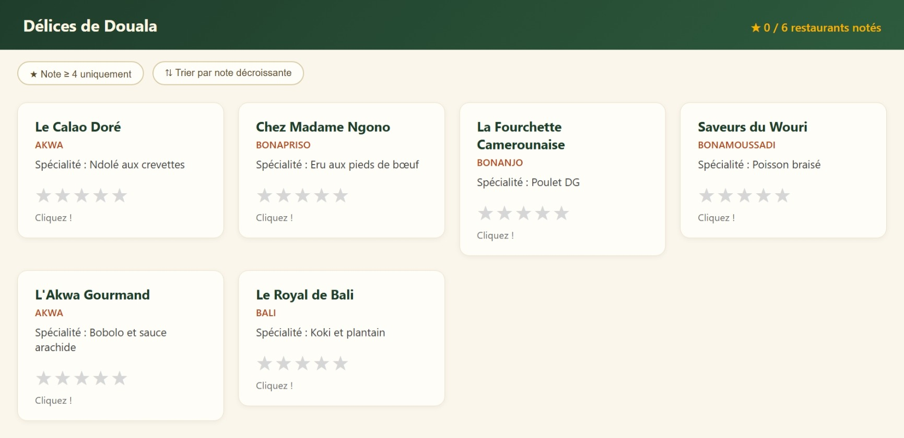
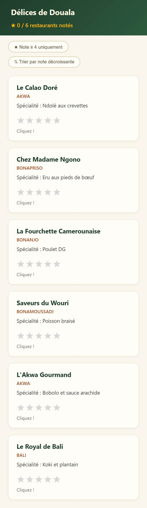

# Les-Delices-De-Douala
>Un client tient un guide culinaire à Douala réferencant les meilleurs restaurant de la ville
>Projet réalisé dans le cadre d'Angular Talent Lab 2026.
## Captures d'écran

### Desktop

### Mobile

## Technologies utilisées
- Angular 22.0.1
- TypeScript 5.9+
- npm 11.17.0
## Fonctionnalités
- ✅ Layout responsive (Desktop / Tablette / Mobile)
- ✅ Liste des restaurants de la ville avec les plats de spécialités
- ✅ système de notation de chaque restaurant grace au nombre d'étoile
- ✅ Affichage du nombre de restaurant notés
- ✅ moyenne de note obtenus par ces restaurant
## Lancer le projet en local
\`\`\`bash
git clone https://github.com/mesmine2/-delices-de-douala-tp.git
cd -delices-de-douala-tp
npm install
ng serve --port 4200 --open
\`\`\`
## Déploiement

Le projet est déployé sur Vercel : [https://delices-de-douala-tp-zeta.vercel.app/]

## Auteur
[PANKUI KAMTCHA MESMINE CHANELLE] — Apprenant Angular Talent Lab 2026 — Cohorte Douala